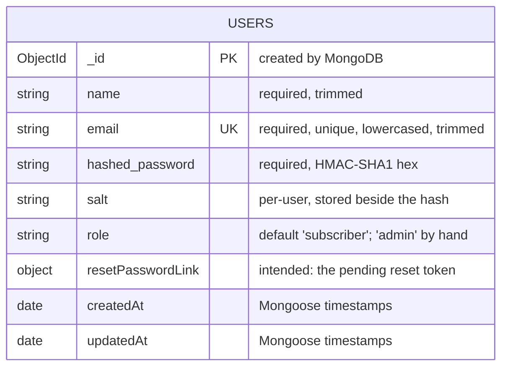

# Data model: mern-auth-api

This explains the database to someone who has to change it next month. It describes what the code does today, including the parts that look like mistakes, because those are the parts that bite.

**Database:** MongoDB, accessed through Mongoose 5. **Collections:** one, `users` (Mongoose pluralises the model name `User`). There are no other collections, no references between documents, and no transactions.

## 1. The shape



There is a single entity, so there are no foreign keys. Nothing else in the system is stored. Understanding the model therefore means understanding four *implicit* links that the diagram cannot draw:

| Link | How it is made | Where |
|---|---|---|
| **Signed-in session ↔ user** | The sign-in JWT contains only `{ _id }`. Every protected request looks the user up by that id. | `signin`, `requireSignin`, `update`, `adminMiddleware` |
| **Pending account ↔ nothing** | Between sign-up and clicking the email link there is **no database row**. The name, email and password travel inside the activation JWT. The user document is created only on activation. | `signup`, `accountActivation` |
| **Pending reset ↔ user** | The reset token is stored on the user document (`resetPasswordLink`) and later found again by string equality. | `forgotPassword`, `resetPassword` |
| **Google / Facebook identity ↔ user** | Matched by **email address only**. No provider name or provider user id is stored, so the database cannot tell how an account was created. | `googleLogin`, `facebookLogin` |

### The `users` collection, field by field

| Field | Type | Purpose |
|---|---|---|
| `_id` | ObjectId | Primary key. Goes into every JWT and is the argument of `GET /user/:id`. |
| `name` | String | Display name. Shown in the nav bar and on the profile. |
| `email` | String | Login identifier and the only link to Google/Facebook identities. |
| `hashed_password` | String | `HMAC-SHA1(salt, password)` as hex. Never returned by the API (controllers set it to `undefined` before responding). |
| `salt` | String | Stored with the hash. Generated as `Math.round(Date.now() * Math.random())` as a string. |
| `role` | String | `'subscriber'` by default. Becomes `'admin'` only by editing the document directly; no endpoint promotes anyone. |
| `resetPasswordLink` | see §3 | Meant to hold the outstanding reset token. Cleared to `''` after a successful reset. |
| `createdAt`, `updatedAt` | Date | Added by `{ timestamps: true }`. |

**Virtual `password`.** `password` is not stored. Assigning `user.password = 'x'` runs a setter that generates a new salt and writes `salt` and `hashed_password`. This is why `User.save()` with a `password` field works, and why reading the password back returns only the in-memory plaintext of the current object.

**Instance methods.** `authenticate(plain)` recomputes the hash and compares strings; `encryptPassword`, `makeSalt` are the helpers.

## 2. Constraints, and what each one prevents

Each row is a rule about the world. The last column is what goes wrong if you remove it.

| Constraint | Where | What it prevents |
|---|---|---|
| **Unique index on `email`** (`unique: true` creates `email_1`) | schema | Two accounts for one address. This is the real guard, not the `findOne` check in `signup`: that check happens when the email is *sent*, and the insert happens later, when the link is *clicked* (up to 10 minutes on). Two people can both pass the check; the index makes the second insert fail (the API answers 401 "Error saving user in database"). It also gives `signin` a fast lookup (§4). |
| **`email`: `lowercase: true`, `trim: true`** | schema | `Ann@x.com` and `ann@x.com` becoming two accounts, and trailing spaces from copy-paste. It only helps if lookups are normalised too. `signin` does `findOne({ email })` with the raw body value, so **test that a mixed-case sign-in works** before relying on it. |
| **`required: true` on `name`, `email`, `hashed_password`** | schema | Users with no way to sign in or no display name. Because the password is a virtual, `required` on `hashed_password` is what actually rejects "no password". |
| **`role` default `'subscriber'`** | schema | New accounts starting with any privilege. New users always start at the lowest level. |
| **`timestamps: true`** | schema | Not a safety rule; gives you a signup date and last-change date for free. |
| **Request validators** (`name` non-empty, valid `email`, password ≥ 6, new password ≥ 6) | `validators/auth.js` | Junk reaching the database or the token. These are *not* database constraints: anything that bypasses the API (a script, a manual insert) is not checked. |
| **Password ≥ 6 in `update`** | `controllers/user.js` | Weakening a password through profile edit. Duplicates the validator rule by hand. |

### Constraints that do **not** exist (and matter)

- **`name: { max: 32 }` does nothing.** In Mongoose, `max` applies to numbers and dates. The string equivalent is `maxlength`. A 500-character name is accepted today. (Save one to confirm.)
- **`role` has no `enum`.** Any string is valid, including a typo like `'admn'`. Code checks `role === 'admin'` and `role === 'subscriber'` by exact match, so a typo'd user matches neither and sees no nav link at all.
- **No uniqueness or index on `resetPasswordLink`.**
- **No identity-provider field**, so you cannot distinguish a password account from a Google account, or stop a Google login from taking over a password account with the same email.
- **No "email verified" flag.** Verification is enforced by *not creating the row until the link is used*; social accounts are trusted by the provider.

## 3. A schema definition that is probably broken

```js
resetPasswordLink: {
    data: String,
    default: ''
},
```

Mongoose reads a nested object with no `type` key as a **nested sub-document with two string fields named `data` and `default`**. It does not read it as "a string with default empty". The controllers then use the field as a plain string: `user.updateOne({ resetPasswordLink: token })` and `User.findOne({ resetPasswordLink })`. Against a nested path, the string is very likely either rejected as a cast error or dropped by strict mode, which would mean **reset tokens are never persisted and password reset always fails** with "Something went wrong. Try later". I read the code but did not run it, so verify by requesting a reset and then inspecting the document:

```js
db.users.findOne({ email: 'admin@example.com' }, { resetPasswordLink: 1 })
```

The fix is one line: `resetPasswordLink: { type: String, default: '' }`. Until then, treat §4's reset-query analysis as describing the *intended* behaviour.

## 4. The queries that carry the load

| # | Query | Endpoint | Index used | Frequency |
|---|---|---|---|---|
| Q1 | `findOne({ email })` | `signin`, `signup` (exists-check), `forgotPassword`, Google/Facebook login | `email_1` (unique) | Every sign-in and sign-up. The hottest query. |
| Q2 | `findById(_id)` / `findOne({ _id })` | `read`, `update`, `adminMiddleware` | `_id_` | Every profile load and edit; every admin request. |
| Q3 | `save()` on a new document | activation, social first-login | writes to `_id_` and `email_1` | Once per account. |
| Q4 | `updateOne({ _id }, { resetPasswordLink })` (through `user.updateOne`) | `forgotPassword` | `_id_` | Per reset request. |
| Q5 | `findOne({ resetPasswordLink })` | `resetPassword` | **none: collection scan** | Per completed reset. Only reachable with a token that already passed `jwt.verify`. |

Q1 and Q2 are point lookups on unique indexes. Q5 is the only one that reads without an index.

### Query plans

Run these in `mongosh` against your database. The first shows the indexed path used by sign-in (Q1); the second shows the scan (Q5).

```js
db.users.getIndexes()

db.users.find({ email: 'admin@example.com' }).explain('executionStats')

db.users.find({ resetPasswordLink: 'some-token' }).explain('executionStats')
```

To see the difference, load enough rows to matter first. This inserts 200,000 users in a few seconds (fake hashes, not for signing in):

```js
const docs = []
for (let i = 0; i < 200000; i++) {
  docs.push({ name: 'User ' + i, email: 'user' + i + '@example.com',
              hashed_password: 'x', salt: 'y', role: 'subscriber',
              createdAt: new Date(), updatedAt: new Date() })
}
db.users.insertMany(docs, { ordered: false })
```

**What the two plans look like** (this is the expected *shape*, from how MongoDB executes these queries; it is not captured output. Replace it with your own before you submit):

```
Q1  find({ email })
    winningPlan:  FETCH
                    └── IXSCAN   indexName: "email_1"   direction: forward
    totalKeysExamined: 1     totalDocsExamined: 1     nReturned: 1

Q5  find({ resetPasswordLink })
    winningPlan:  COLLSCAN   direction: forward
    totalKeysExamined: 0     totalDocsExamined: <every document>     nReturned: 0 or 1
```

The numbers to read are `totalDocsExamined` against `nReturned`. Q1 examines one document to return one. Q5 examines the whole collection to return at most one. That ratio is the whole story.

> **Paste your captured output here before submitting:** `explain('executionStats')` for Q1 and Q5 on the 200,000-row collection, plus `executionTimeMillis` for each.

## 5. What breaks first at ten times the data

**Q5: `findOne({ resetPasswordLink })`.** It is the only query whose work grows with the collection. Every other hot path is an index lookup whose cost hardly changes between 100,000 and 1,000,000 rows. Q5 reads every document until it finds a match, so its cost is proportional to the user count, and each read pulls documents through the WiredTiger cache, evicting hot pages that sign-in needs.

Why it is not worse today: it can only run after `jwt.verify` accepts the token, so unauthenticated traffic cannot drive it. It degrades with *legitimate* reset volume times collection size.

**The fix, in order of effort:**

1. Correct the schema (§3), then add an index: `userSchema.index({ resetPasswordLink: 1 }, { sparse: true })`. Store `''` less and prefer removing the field on reset, so the sparse index stays small.
2. Better: stop storing the token on the user. Put pending resets in their own collection with a **TTL index** (`expireAfterSeconds: 600`), keyed by a hash of the token. That also matches the 10-minute lifetime the JWT already has, and fixes the "token lingers until used" behaviour of today's design.
3. Best for this design: the token is already a signed JWT that contains `_id`. Verify it, then `findById(decoded._id)` (an indexed lookup) and compare the stored token to the presented one. Q5 disappears without a new index.

**What breaks next** (not data volume, but request volume, and not query related): sign-in CPU once password hashing moves from HMAC-SHA1 to bcrypt or argon2. See the "ten times the traffic" list in `README.md`.

## 6. Changing the model next month: what to be careful of

- **Changing the hash algorithm needs a migration path.** The document does not record which algorithm produced `hashed_password`. Add a field like `hashVersion` *first*, then verify old hashes on sign-in and rewrite them to the new scheme (upgrade on login).
- **Adding a required field breaks existing documents on their next `save()`.** Mongoose validates the whole document, not just changed fields. Make new fields optional, backfill, then tighten.
- **Tightening `role` to an `enum`** will reject the next save of any existing document that holds a typo'd value. Query `db.users.distinct('role')` first.
- **Adding a provider field** (`provider`, `providerId`) is the natural next step and fixes the "matched by email only" issue. Use a compound unique index on `{ provider, providerId }` with a partial filter so password accounts (no `providerId`) are exempt.
- **Fixing `resetPasswordLink`** changes its type from an object to a string. Existing documents have no stored token today (or a nested object), so no data migration is needed, but clear the field first with `db.users.updateMany({}, { $unset: { resetPasswordLink: '' } })`.
- **Index builds:** `unique: true` on `email` is created on app start. Adding indexes to a large collection through the same mechanism blocks startup on some setups; build them separately and turn off `autoIndex` in production.
- **Read the response filters.** The controllers hide `hashed_password` and `salt` by setting them to `undefined` per endpoint, not by the schema (`select: false`). A new endpoint that returns a user will leak both unless it repeats that. `GET /user/:id` also returns `resetPasswordLink` today. Making those fields `select: false` in the schema would fix this once, in one place.
